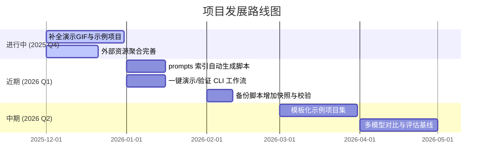

<!--
-------------------------------------------------------------------------------
  项目头部区域 (HEADER)
-------------------------------------------------------------------------------
-->
<p align="center">
  <!-- 建议尺寸: 1280x640px。可以使用 Canva, Figma 或 https://banners.beyondco.de/ 等工具制作 -->
  
</p>

<div align="center">

# Vibe Coding 指南

**一个通过与 AI 结对编程，将想法变为现实的终极工作站**

---

<!--
  徽章区域 (BADGES)
-->
<!-- 项目状态徽章 -->
<p>
  <a href="LICENSE"></a>
  <a href="https://github.com/tukuaiai/vibe-coding-cn"></a>
  <a href="https://github.com/tukuaiai/vibe-coding-cn"></a>
  <a href="https://x.com/123olp"></a>
  <a href="https://t.me/glue_coding"></a>
</p>

<!-- 资源直达 - 按重要性分组 -->
<!-- 🔴 核心理念 (红色系) -->
<p>
	  <a href="./assets/documents/principles/philosophy/README.md"></a>
	  <a href="./assets/documents/principles/philosophy/理解世界、描述变化、整理知识的一套较小框架.md"></a>
	  <a href="./assets/documents/guides/getting-started/Vibe%20Coding%20哲学原理.md"></a>
	  <a href="./assets/documents/guides/getting-started/README.md"></a>
	  <a href="./assets/documents/principles/fundamentals/问题求解能力.md"></a>
	  <a href="./assets/documents/principles/fundamentals/语言层要素.md"></a>
	  <a href="./assets/documents/principles/fundamentals/常见坑汇总.md"></a>
	  <a href="./assets/documents/principles/fundamentals/强前置条件约束.md"></a>
	  <a href="./assets/README.md"></a>
  <a href="./assets/skills/"></a>
  <a href="https://docs.google.com/spreadsheets/d/1Ifk_dLF25ULSxcfGem1hXzJsi7_RBUNAki8SBCuvkJA/edit?gid=1254297203#gid=1254297203"></a>
</p>

[📋 工具与资源](#tools)
[⚡ 1 分钟快速开始](#getting-started)
[🚀 孵化我的项目](#create-my-project)
[🎯 原仓库翻译](#translation)
[⚙️ 完整设置流程](#setup)
[📞 联系方式](#contact)
[✨ 支持项目](#support)
[🤝 参与贡献](#contributing)

本仓库的 AI 解读链接：[zread.ai/tukuaiai/vibe-coding-cn](https://zread.ai/tukuaiai/vibe-coding-cn/1-overview)

</div>

## 🎲 前言

**这是一个不断生长和自我否定的项目，当下的一切经验和能力都可能因 AI 能力的变化而失去意义，所以请时刻保持以 AI 为主的思维，重视这次宇宙级的变革，所有的经验都可能失效，辩证的看🙏🙏🙏**，**Vibe Coding** 是一个与 AI 结对编程的终极工作流程，旨在帮助开发者丝滑地将想法变为现实。本指南详细介绍了从项目构思、技术选型、实施规划到具体开发、调试和扩展的全过程，强调以**规划驱动**和**模块化**，**索引构建**为核心（受限于模型上下文窗口而生成的解决策略），避免让 AI 失控导致项目混乱，Vibe Coding（氛围编程）是一种以自然语言驱动、让LLM生成大部分代码的开发方式，主张"先沉浸式做出能跑的东西"，以极低门槛快速产出原型但也伴随可控性与可靠性风险，由计算机科学家 [Andrej Karpathy](https://x.com/karpathy) 首次提出。

> **注意**：以下经验分享并非普遍适用，请在具体实践中结合场景，辩证采纳（点击标题可以展开收起内容）

---

<a id="create-my-project"></a>

<details open>
<summary><strong>🚀 孵化我的项目（新用户从这里开始）</strong></summary>

## 🚀 孵化我的项目

> 你有一个想法，想用 vibe-coding-cn 把它变成代码项目？跟着下面的步骤走。

### 你有什么？

一行命令，你就能拥有：

| 资源 | 说明 |
|------|------|
| **37 个 Skills** | 让 AI 变成领域专家（量化交易、数据库、Telegram Bot、Flutter…） |
| **vibe-init.sh** | 一行命令创建新项目（自动下载 Skills + 生成配置，无需克隆仓库） |
| **全自动工作流** | 需求→计划→实施→验证的 5 步闭环 |
| **提示词库** | 编程场景专用提示词 |
| **案例研究** | 真实项目的完整开发过程 |

### 4 步完成你的项目

**第 1 步：一行命令，创建项目**

```bash
# 下载脚本并运行（自动从 GitHub 获取母机资源，无需克隆仓库）
curl -fsSL https://raw.githubusercontent.com/yongc2025/vibe-coding-cn/develop/vibe-init.sh -o vibe-init.sh && chmod +x vibe-init.sh

# 选择你的 AI 助手，创建项目
./vibe-init.sh --ai copilot --type quant-crypto --name my-bot

# 用完清理脚本
rm vibe-init.sh
```

`--ai` 参数决定生成哪个 AI 工具的入口文件，`--type` 决定业务类型和 Skills：

```bash
# Claude Code 用户
./vibe-init.sh --ai claude --type quant-crypto --name my-bot

# Cursor 用户
./vibe-init.sh --ai cursor --type app --name my-app

# GitHub Copilot 用户
./vibe-init.sh --ai copilot --type enterprise --name my-enterprise

# 不确定用什么？生成全部入口文件
./vibe-init.sh --ai all --type quant-crypto --name my-bot

# 自定义 Skills
./vibe-init.sh --ai claude --type custom --name my-project --skills ccxt,postgresql,canvas-dev

# 先预览不执行
./vibe-init.sh --ai claude --type quant-crypto --name my-bot --dry-run
```

脚本会自动：
- 从 GitHub 下载母机的 Skills（无需手动克隆仓库）
- 复制对应业务类型的 Skills 到 `.skills/`
- 生成你选择的 AI 工具入口文件（CLAUDE.md / .cursorrules / copilot-instructions.md 等）
- 初始化 Git 仓库

**第 2 步：填写项目定义**

进入项目目录，编辑 `docs/PROJECT_BRIEF.md`，回答 4 个问题：
1. **目标**：我要解决什么问题？
2. **现状**：当前是什么情况？
3. **差距**：从现状到目标，缺什么？
4. **判断标准**：怎么知道做完了？

**第 3 步：用 AI 开发**

AI 助手会自动读取入口文件和 `.skills/` 下的 SKILL.md，你只需要描述需求：
```bash
# 查看已复制的 Skills
ls .skills/

# 推荐开发顺序：
# 接口定义 → 配置管理 → 核心实现 → 数据集成 → 测试验证
```

**第 4 步：验证与提交**
```bash
pytest tests/ -v
git add . && git commit -m "feat: 完成核心功能"
git push origin main
```

📖 **详细指南**：[docs/onboarding/孵化我的项目.md](./docs/onboarding/孵化我的项目.md)
📖 **分步指南**：[docs/onboarding/分步指南.md](./docs/onboarding/分步指南.md)
📖 **技能推荐**：`python assets/scripts/skill-picker.py --list`

### 支持的 AI 助手

| --ai 参数 | 生成的文件 | 对应工具 |
|-----------|-----------|---------|
| `claude` | `CLAUDE.md` | Claude Code |
| `cursor` | `.cursorrules` | Cursor |
| `copilot` | `.github/copilot-instructions.md` | GitHub Copilot |
| `windsurf` | `.windsurfrules` | Windsurf |
| `cline` | `.clinerules` | Cline |
| `codex` | `AGENTS.md` | OpenAI Codex |
| `all` | 以上全部 | 不确定时用这个 |

### 支持的项目类型

| --type 参数 | 默认 Skills |
|-------------|------------|
| `quant-crypto` | ccxt, cryptofeed, hummingbot, coingecko, polymarket, postgresql, timescaledb, proxychains |
| `quant-astock` | postgresql, timescaledb |
| `quant-usstock` | postgresql, timescaledb, twscrape, proxychains |
| `app` | canvas-dev, ddd-doc-steward, snapdom |
| `enterprise` | canvas-dev, ddd-doc-steward, sop-generator, postgresql, claude-cookbooks |
| `saas` | canvas-dev, ddd-doc-steward, sop-generator, postgresql, telegram-dev, snapdom |
| `custom` | 手动指定 --skills |

> 💡 所有类型都自动包含基础技能：skills-skills, sop-generator, canvas-dev, headless-cli

</details>

---

<a id="getting-started"></a>

<details>
<summary><strong>⚡ 1 分钟快速开始</strong></summary>

## ⚡ 1 分钟快速开始

> 最快的方式：一行命令初始化项目，然后告诉 AI 你的想法。

**第 1 步**：下载脚本，一行命令初始化项目

```bash
curl -fsSL https://raw.githubusercontent.com/yongc2025/vibe-coding-cn/develop/vibe-init.sh -o vibe-init.sh && chmod +x vibe-init.sh
./vibe-init.sh --ai copilot --type app --name my-project
rm vibe-init.sh
cd my-project
```

**第 2 步**：用你的 AI 助手打开项目目录

```bash
# Claude Code:  claude
# Cursor:       用 Cursor 打开
# Copilot:      用 VS Code 打开
```

**第 3 步**：告诉 AI 你的想法，开始开发 🚀

```
请阅读 docs/PROJECT_BRIEF.md 和 .skills/ 下的文档，帮我实现 [你的项目描述]。
```

**就这么简单！** 更多内容（新手从零开始）请继续阅读 👇

### 🚀 从零开始

> **基础前提（建议先看）**：为了让后续所有"方法/步骤/工作流"可被稳定复用，本项目默认使用一套极简概念框架来理解世界、描述变化与整理知识：对象 → 状态 → 快照 → 序列 → 过程 → 变换 → 同一/差异 → 关系。
> 阅读：[`理解世界、描述变化、整理知识的一套较小框架`](./assets/documents/principles/philosophy/理解世界、描述变化、整理知识的一套较小框架.md)

完全新手？按顺序完成以下步骤：

0. [问题求解能力](./assets/documents/principles/fundamentals/问题求解能力.md) - "目标-现状-差距-标准"与"目标-约束-对象-路径"的极简框架
1. [Vibe Coding 哲学原理](./assets/documents/guides/getting-started/Vibe%20Coding%20哲学原理.md) - 理解核心理念
2. [网络环境配置](./assets/documents/guides/getting-started/网络环境配置.md) - 配置网络访问
3. [开发环境搭建](./assets/documents/guides/getting-started/开发环境搭建.md) - 复制提示词给 AI，让 AI 指导你搭建环境
4. [IDE配置](./assets/documents/guides/getting-started/IDE配置.md) - 配置 VS Code 编辑器
5. [OpenCode-CLI配置](./assets/documents/guides/getting-started/OpenCode-CLI配置.md) - 免费 AI CLI 工具，支持 GLM-4.7/MiniMax M2.1 等模型
6. [数据集导向数据服务模板](./assets/documents/principles/fundamentals/数据集导向数据服务模板.md) - 以 dataset/contract/registry/runtime 为核心的数据采集服务通用架构模板

</details>

<details>
<summary><strong>🧪 实验性方法</strong></summary>

## 🧪 实验性方法

> **基础前提**：本节中的"实验性范式/方法论工具箱"默认共享同一套概念框架（对象/状态/快照/序列/过程/变换/同一-差异/关系），并默认以 Harness Engineering 的闭环与评估机制作为可靠性来源，否则术语会漂移、实践会失焦。
> 阅读：[`Harness Engineering 的本质拆解`](./assets/documents/principles/fundamentals/Harness%20Engineering%20的本质拆解.md)
> 阅读：[`理解世界、描述变化、整理知识的一套较小框架`](./assets/documents/principles/philosophy/理解世界、描述变化、整理知识的一套较小框架.md)

> 下面是一些"可能随时推翻重写"的实验性方法与范式：先看一眼，觉得对你有用再深入。

**建议阅读顺序（从抽象到落地）**
1. 🔑 元方法论：用"生成器/优化器"的递归闭环让系统自我进化
2. 🧬 胶水编程：复用成熟轮子，把注意力放在"连接方式"
3. 🎨 Canvas白板驱动开发：让白板成为单一真相源，降低协作与上下文成本
4. 🐝 AI蜂群协作：让多个 AI 在 tmux 下互相感知、协作、分工
5. 🔮 哲学方法论工具箱：把抽象方法论落到可验证、可迭代的工程动作

<details>
<summary><strong>🔑 元方法论</strong></summary>

> 一句话：用"生成器/优化器"的递归闭环，构建一个能持续自我优化的 AI 系统。
>
> 延伸阅读：[A Formalization of Recursive Self-Optimizing Generative Systems](./assets/documents/principles/fundamentals/A%20Formalization%20of%20Recursive%20Self-Optimizing%20Generative%20Systems.md)

### 核心角色
- **α-提示词（生成器）**：一个"母体"提示词，其唯一职责是生成其他提示词或技能。
- **Ω-提示词（优化器）**：另一个"母体"提示词，其唯一职责是优化其他提示词或技能。

### 递归生命周期（最小闭环）
1. **创生（Bootstrap）**：使用 AI 生成 `α-提示词` 与 `Ω-提示词` 的初始版本（v1）。
2. **自省与进化（Self-Correction & Evolution）**：用 `Ω-提示词（v1）` 优化 `α-提示词（v1）`，得到更强的 `α-提示词（v2）`。
3. **创造（Generation）**：使用进化后的 `α-提示词（v2）` 生成目标提示词与技能。
4. **循环与飞跃（Recursive Loop）**：将新产物（甚至包括新版本的 `Ω-提示词`）回灌系统，再次用于优化 `α-提示词`，启动持续进化。

### 终极目标
- 通过持续的递归优化循环，让系统在每次迭代中实现自我超越，逼近预设的预期状态。

</details>

<details>
<summary><strong>🧬 胶水编程 (Glue Coding)</strong></summary>

> 一句话：能抄不写，能连不造，能复用不原创。

胶水编程是 Vibe Coding 的终极进化形态，目标是把注意力从"造轮子"迁移到"连接方式"，从而缓解三大致命缺陷：

| 问题 | 解法 |
|:---|:---|
| 🎭 AI 幻觉 | ✅ 只使用已验证的成熟代码，零幻觉 |
| 🧩 复杂性爆炸 | ✅ 每个模块都是久经考验的轮子 |
| 🎓 门槛过高 | ✅ 你只需要描述"连接方式" |

👉 [深入了解胶水编程](./assets/documents/principles/fundamentals/胶水编程.md)

</details>

<details>
<summary><strong>🎨 Canvas白板驱动开发</strong></summary>

> 一句话：让白板成为单一真相源，用"图形"降低协作与上下文成本。

传统开发：代码 → 口头沟通 → 脑补架构 → 代码失控

Canvas方式：**代码 ⇄ 白板 ⇄ AI ⇄ 人类**，白板成为单一真相源

| 痛点 | 解法 |
|:---|:---|
| 🤖 AI看不懂项目结构 | ✅ AI直接读白板JSON，秒懂架构 |
| 🧠 人类记不住复杂依赖 | ✅ 连线清晰，牵一发动全身一目了然 |
| 💬 团队协作靠嘴说 | ✅ 指着白板讲，新人5分钟看懂 |

**核心理念**：图形是第一公民，代码是白板的序列化形式。

👉 [深入了解Canvas白板驱动开发](./assets/documents/guides/playbook/图形化AI协作-Canvas白板驱动开发.md)

</details>

<details>
<summary><strong>🐝 AI蜂群协作</strong></summary>

> 一句话：把多个 AI 变成"可互相感知与协作的集群"，人从瓶颈变为调度者。

传统模式：人 ←→ AI₁, 人 ←→ AI₂, 人 ←→ AI₃ (人是瓶颈)

蜂群模式：**人 → AI₁ ←→ AI₂ ←→ AI₃** (AI 自主协作)

| 能力 | 实现方式 | 效果 |
|:---|:---|:---|
| 🔍 感知 | `capture-pane` | 读取任意终端内容 |
| 🎮 控制 | `send-keys` | 向任意终端发送按键 |
| 🤝 协调 | 共享状态文件 | 任务同步与分工 |

**核心突破**：AI 不再是孤立的，而是可以互相感知、通讯、控制的集群。

👉 [深入了解AI蜂群协作](./assets/documents/guides/playbook/AI蜂群协作-tmux多Agent协作系统.md)

</details>

<details>
<summary><strong>🔮 哲学方法论工具箱</strong></summary>

> 一句话：把抽象方法论落到可验证、可迭代、可收敛的工程产出。

23 种哲学方法论 + Python 工具 + 可复制提示词，覆盖：

| 方法 | 用途 |
|:---|:---|
| 现象学还原 | 需求含糊时，清零脑补，回到可观察事实 |
| 正反合 | 快速可用 → 反例打脸 → 收敛为工程版本 |
| 可证伪主义 | 用测试逼出失败模式 |
| 奥卡姆剃刀 | 删除不必要的复杂度 |
| 贝叶斯更新 | 根据新证据动态调整信念 |

**核心理念**：哲学不是空谈，是可落地的工程方法。

👉 [深入了解哲学方法论工具箱](./assets/documents/principles/philosophy/README.md)

</details>

</details>

<details>
<summary><strong>🧭 经验</strong></summary>

## 🧭 经验

* **状态，变换；数据，函数；输入，处理，输出；抽象/收敛，展开；可解释性；层级；过程；全称/特称，肯定/否定**
* **明确任务中的：目的，对象，约束**
* **人下 AI 上**
* **一切问题问 AI**
* **目的主导：开发过程中的一切动作围绕"目的"展开**
* **上下文是 vibe coding 的第一性要素，垃圾进，垃圾出**
* **系统性思考，从 实体，链接，功能/目的 开始**
* **数据与函数是编程的一切**
* **先结构，后代码**
* **使用帕累托法则，关注重要的那20%**
* **逆向思考，先明确你的需求，从满足需求为起点构建代码**
* **重复，多尝试几次**
* **模仿优先，不重复造轮子，先问 AI 有没有合适的仓库，下载下来改（glue coding 基于 vibe coding全新的方法）**
* **按职责拆模块**
* **接口先行，实现后补**
* **文档即上下文，不是事后补**
* **明确写清：能改什么，不能改什么**
* **Debug 只给：预期 vs 实际 + 最小复现**
* **测试可交给 AI，断言人审**
* **AI 犯的错误使用提示词整理为经验持久化存储，遇到问题始终无法解决，就让AI检索这个收集的问题然后寻找解决方案**

</details>

<a id="tools"></a>

<details>
<summary><strong>📋 工具与资源</strong></summary>

## 📋 工具与资源

### 集成开发环境 (IDE) & 终端

*   [**Visual Studio Code**](https://code.visualstudio.com/): 一款功能强大的集成开发环境，适合代码阅读与手动修改。其 `Local History` 插件对项目版本管理尤为便捷。
*   **虚拟环境 (.venv)**: 强烈推荐使用，可实现项目环境的一键配置与隔离，特别适用于 Python 开发。
*   [**Cursor**](https://cursor.com/): 已经占领用户心智高地，人尽皆知。
*   [**Warp**](https://www.warp.dev/): 集成 AI 功能的现代化终端，能有效提升命令行操作和错误排查的效率。
*   [**Neovim (nvim)**](https://github.com/neovim/neovim): 一款高性能的现代化 Vim 编辑器，拥有丰富的插件生态，是键盘流开发者的首选。
*   [**LazyVim**](https://github.com/LazyVim/LazyVim): 基于 Neovim 的配置框架，预置了 LSP、代码补全、调试等全套功能，实现了开箱即用与深度定制的平衡。

### AI 模型 & 服务

*   [**Claude Opus 4.6**](https://claude.ai/new): 性能强大的 AI 模型，通过 Claude Code 等平台提供服务，并支持 CLI 和 IDE 插件。
*   [**gpt-5.3-codex (xhigh)**](https://chatgpt.com/codex/): 适用于处理大型项目和复杂逻辑的 AI 模型，可通过 Codex CLI 等平台使用。
*   [**Droid**](https://factory.ai/news/terminal-bench): 提供对 Claude Opus 4.6 等多种模型的 CLI 访问。
*   [**Kiro**](https://kiro.dev/): 目前提供免费的 Claude Opus 4.6 模型访问，并提供客户端及 CLI 工具。
*   [**Gemini CLI**](https://geminicli.com/): 提供对 Gemini 模型的免费访问，适合执行脚本、整理文档和探索思路。
*   [**antigravity**](https://antigravity.google/): 目前由 Google 提供的免费 AI 服务，支持使用 Claude Opus 4.6 和 Gemini 3.0 Pro。
*   [**AI Studio**](https://aistudio.google.com/prompts/new_chat): Google 提供的免费服务，支持使用 Gemini 3.0 Pro 和 Nano Banana。
*   [**Gemini Enterprise**](https://cloud.google.com/gemini-enterprise): 面向企业用户的 Google AI 服务，目前可以免费使用。
*   [**GitHub Copilot**](https://github.com/copilot): 由 GitHub 和 OpenAI 联合开发的 AI 代码补全工具。
*   [**Kimi K2.5**](https://www.kimi.com/): 一款国产 AI 模型，适用于多种常规任务。
*   [**GLM**](https://bigmodel.cn/): 由智谱 AI 开发的国产大语言模型。
*   [**Qwen**](https://qwenlm.github.io/qwen-code-docs/zh/cli/): 由阿里巴巴开发的 AI 模型，其 CLI 工具提供免费使用额度。

### 开发与辅助工具

*   [**Augment**](https://app.augmentcode.com/): 提供强大的上下文引擎和提示词优化功能。
*   [**Windsurf**](https://windsurf.com/): 为新用户提供免费额度的 AI 开发工具。
*   [**Ollama**](https://ollama.com/): 本地大模型管理工具，可通过命令行方便地拉取和运行开源模型。
*   [**Mermaid Chart**](https://www.mermaidchart.com/): 用于将文本描述转换为架构图、序列图等可视化图表。
*   [**NotebookLM**](https://notebooklm.google.com/): 一款用于 AI 解读资料、音频和生成思维导图的工具。
*   [**Zread**](https://zread.ai/): AI 驱动的 GitHub 仓库阅读工具，有助于快速理解项目代码。
*   [**tmux**](https://github.com/tmux/tmux): 强大的终端复用工具，支持会话保持、分屏和后台任务，是服务器与多项目开发的理想选择。
*   [**DBeaver**](https://dbeaver.io/): 一款通用数据库管理客户端，支持多种数据库，功能全面。

### 资源与模板

*   [**提示词库 (在线表格)**](https://docs.google.com/spreadsheets/d/1Ifk_dLF25ULSxcfGem1hXzJsi7_RBUNAki8SBCuvkJA/edit?gid=1254297203#gid=1254297203): 一个包含大量可直接复制使用的各类提示词的在线表格。
*   [**第三方系统提示词学习库**](https://github.com/x1xhlol/system-prompts-and-models-of-ai-tools): 用于学习和参考其他 AI 工具的系统提示词。
*   [**Skills 制作器**](https://github.com/yusufkaraaslan/Skill_Seekers): 可根据需求生成定制化 Skills 的工具。
*   [**元提示词**](https://docs.google.com/spreadsheets/d/1Ifk_dLF25ULSxcfGem1hXzJsi7_RBUNAki8SBCuvkJA/edit?gid=1254297203#gid=1254297203): 用于生成提示词的高级提示词。
*   [**通用项目架构模板**](./assets/documents/principles/fundamentals/通用项目架构模板.md): 可用于快速搭建标准化的项目目录结构。
*   [**元技能：Skills 的 Skills**](./assets/skills/skills-skills/SKILL.md): 用于生成 Skills 的元技能。
*   [**SOP 生成 Skill**](./assets/skills/sop-generator/SKILL.md): 将资料/需求整理为可执行 SOP 的技能。
*   [**tmux快捷键大全**](./assets/documents/guides/playbook/tmux快捷键大全.md): tmux 的快捷键参考文档。
*   [**LazyVim快捷键大全**](./assets/documents/guides/playbook/LazyVim快捷键大全.md): LazyVim 的快捷键参考文档。
*   [**手机远程 Vibe Coding**](./assets/documents/guides/playbook/关于手机ssh任意位置链接本地计算机，基于frp实现的方法.md): 基于 frp 实现手机 SSH 远程控制本地电脑进行 Vibe Coding。

### 外部教程与资源

*   [**二哥的Java进阶之路**](https://javabetter.cn/): 包含多种开发工具的详细配置教程。
*   [**虚拟卡**](https://www.bybit.com/cards/?ref=YDGAVPN&source=applet_invite): 可用于注册云服务等需要国际支付的场景。

### 交流社区

*   [**Telegram 交流群**](https://t.me/glue_coding): Vibe Coding 中文交流群
*   [**Telegram 频道**](https://t.me/tradecat_ai_channel): 项目更新与资讯

### 项目内部文档

*   [**胶水编程 (Glue Coding)**](./assets/documents/principles/fundamentals/): 软件工程的圣杯与银弹，Vibe Coding 的终极进化形态。
*   [**Chat Vault**](./assets/repo/chat-vault/): AI 聊天记录保存工具，支持 Codex/Kiro/Gemini/Claude CLI。
*   [**prompts-library 工具说明**](./assets/repo/prompts-library/): 支持 Excel 与 Markdown 格式互转，包含数百个精选提示词。
*   [**编程提示词集合**](https://docs.google.com/spreadsheets/d/1Ifk_dLF25ULSxcfGem1hXzJsi7_RBUNAki8SBCuvkJA/edit?gid=1254297203#gid=1254297203): 适用于 Vibe Coding 流程的专用提示词（云端表格）。
*   [**系统提示词构建原则**](./assets/documents/principles/fundamentals/系统提示词构建原则.md): 构建高效 AI 系统提示词的综合指南。
*   [**开发经验总结**](./assets/documents/principles/fundamentals/开发经验.md): 变量命名、文件结构、编码规范、架构原则等。
*   [**通用项目架构模板**](./assets/documents/principles/fundamentals/通用项目架构模板.md): 多种项目类型的标准目录结构。
*   [**Augment MCP 配置文档**](./assets/documents/guides/playbook/auggie-mcp配置文档.md): Augment 上下文引擎配置说明。
*   [**系统提示词集合**](https://docs.google.com/spreadsheets/d/1Ifk_dLF25ULSxcfGem1hXzJsi7_RBUNAki8SBCuvkJA/edit?gid=1254297203#gid=1254297203): AI 开发的系统提示词，含多版本开发规范（云端表格）。
*   [**TradeCat Sheets API 使用说明**](./assets/documents/guides/playbook/tradecat-sheets-api-usage.md): 把公开 Google Sheet 当作 API 注册表与数据面（Data Plane），供 Agent/服务端消费结构化 JSON。
*   [**外部资源（在线表格）**](./assets/README.md): 外部资源的唯一真相源（按类型分表），本地 Markdown 保留为历史参考。

---

</details>

<details>
<summary><strong>🏁 编码模型性能分级参考</strong></summary>

## 🏁 编码模型性能分级参考

建议只选择苹果模型处理复杂任务，以确保最佳效果与效率。

*   **苹果**: [gpt-5.2-xhigh](https://chatgpt.com/codex)

---

</details>

<details>
<summary><strong>🗂️ 项目目录结构概览</strong></summary>

## 🗂️ 项目目录结构概览

本项目 `vibe-coding-cn` 的核心结构主要围绕知识管理、AI 提示词的组织与自动化展开。以下是经过整理和简化的目录树及各部分说明：

```
.
├── README.md                    # 项目主文档
├── AGENTS.md                    # AI Agent 行为准则
├── Makefile                     # 自动化脚本
├── LICENSE                      # MIT 许可证
├── CODE_OF_CONDUCT.md           # 行为准则
├── CONTRIBUTING.md              # 贡献指南
├── .gitignore                   # Git 忽略规则
│
├── assets/                      # 外部资源（指向在线表格）
│   ├── README.md                # 远程表格索引（唯一真相源）
│   ├── AGENTS.md                # assets/ 目录规则
│   ├── config/                  # 工具与开发配置
│   │   └── .codex/              # Codex CLI 配置（项目级）
│   │       ├── config.toml      # Codex CLI 配置文件
│   │       └── AGENTS.md        # Codex/Agent 指南（本目录）
│   ├── documents/               # 文档库
│   │   ├── principles/          # 原则与思想（fundamentals + philosophy）
│   │   │   ├── fundamentals/    # 原 00-基础指南
│   │   │   └── philosophy/      # 原 05-哲学与方法论
│   │   ├── guides/              # 入门与方法（getting-started + playbook）
│   │   │   ├── getting-started/ # 原 01-入门指南
│   │   │   └── playbook/        # 原 02-方法论
│   │   └── case-studies/        # 原 03-实战
│   ├── prompts/                 # 提示词库（指向云端表格）
│   │   ├── README.md            # 在线表格链接
│   │   └── AGENTS.md            # prompts/ 目录规则
│   ├── skills/                  # 技能库（扁平化）
│   │   ├── README.md            # skills 总览与索引
│   │   ├── AGENTS.md            # skills/ 目录规则
│   │   ├── skills-skills/       # 元技能核心
│   │   ├── sop-generator/       # SOP 生成
│   │   ├── canvas-dev/          # Canvas白板驱动开发
│   │   └── ...                  # 更多技能
│   ├── tools/                   # 工具目录（预留）
│   │   └── .gitkeep             # 保持空目录被 Git 追踪
│   ├── workflow/                # 工作流模板
│   │   ├── auto-dev-loop/       # 自动开发循环
│   │   └── canvas-dev/          # Canvas白板驱动开发
│   └── repo/                    # 外部工具与依赖镜像（含 Git submodule）
│       ├── README.md            # 外部工具索引
│       ├── prompts-library/     # Excel ↔ Markdown 互转工具
│       ├── chat-vault/          # AI 聊天记录保存工具
│       ├── Skill_Seekers-development/ # Skills 制作器
│       ├── html-tools-main/     # HTML 工具集
│       ├── my-nvim/             # Neovim 配置
│       ├── MCPlayerTransfer/    # MC 玩家迁移工具
│       ├── XHS-image-to-PDF-conversion/ # 小红书图片转 PDF
│       ├── backups/             # 历史备份脚本快照
│       ├── .tmux/               # oh-my-tmux (submodule)
│       ├── tmux/                # tmux 源码 (submodule)
│       └── claude-official-skills/ # Claude 官方 skills (submodule)
│
├── .github/                     # GitHub 配置
│   ├── workflows/               # CI/CD 工作流
│   │   ├── ci.yml               # Markdown lint + link checker
│   │   ├── labeler.yml          # 自动标签
│   │   └── welcome.yml          # 欢迎新贡献者
│   ├── ISSUE_TEMPLATE/          # Issue 模板
│   ├── PULL_REQUEST_TEMPLATE.md # PR 模板
│   ├── SECURITY.md              # 安全政策
│   ├── FUNDING.yml              # 赞助配置
│   └── wiki/                    # GitHub Wiki 内容
```

</details>

<details>
<summary><strong>📺 演示与产出</strong></summary>

## 📺 演示与产出

一句话：Vibe Coding = **规划驱动 + 上下文固定 + AI 结对执行**，让「从想法到可维护代码」变成一条可审计的流水线，而不是一团无法迭代的巨石文件。

**你能得到**
- 成体系的提示词工具链：[云端表格](https://docs.google.com/spreadsheets/d/1Ifk_dLF25ULSxcfGem1hXzJsi7_RBUNAki8SBCuvkJA/edit?gid=1254297203#gid=1254297203) 提供系统提示词约束 AI 行为边界，编程提示词提供需求澄清、计划、执行的全链路脚本。
- 闭环交付路径：需求 → 上下文文档 → 实施计划 → 分步实现 → 自测 → 进度记录，全程可复盘、可移交。

<details>
<summary><strong>⚙️ 架构与工作流程</strong></summary>

## ⚙️ 架构与工作流程

核心资产映射：
```
assets/prompts/
  README.md  # 云端表格入口（元/系统/编程/用户提示词）
assets/skills/
  README.md  # skills 总览与索引
assets/documents/
  principles/fundamentals/*, principles/philosophy/*, guides/*, case-studies/* 等知识库
assets/
  README.md  # 外部资源（在线表格）唯一真相源入口
assets/repo/backups/
  一键备份.sh, 快速备份.py  # 本地/远端快照脚本
```

```mermaid
graph TB
  %% GitHub 兼容简化版（仅使用基础语法）

  subgraph ext_layer[外部系统与数据源层]
    ext_contrib[社区贡献者]
    ext_sheet[Google 表格 / 外部表格]
    ext_md[外部 Markdown 提示词]
    ext_api[预留：其他数据源 / API]
    ext_contrib --> ext_sheet
    ext_contrib --> ext_md
    ext_api --> ext_sheet
  end

  subgraph ingest_layer[数据接入与采集层]
    excel_raw[prompt_excel/*.xlsx]
    md_raw[prompt_docs/外部MD输入]
    excel_to_docs[assets/repo/prompts-library/scripts/excel_to_docs.py]
    docs_to_excel[assets/repo/prompts-library/scripts/docs_to_excel.py]
    ingest_bus[标准化数据帧]
    ext_sheet --> excel_raw
    ext_md --> md_raw
    excel_raw --> excel_to_docs
    md_raw --> docs_to_excel
    excel_to_docs --> ingest_bus
    docs_to_excel --> ingest_bus
  end

  subgraph core_layer[数据处理与智能决策层 / 核心]
    ingest_bus --> validate[字段校验与规范化]
    validate --> transform[格式映射转换]
    transform --> artifacts_md[prompt_docs/规范MD]
    transform --> artifacts_xlsx[prompt_excel/导出XLSX]
    orchestrator[main.py · scripts/start_convert.py] --> validate
    orchestrator --> transform
  end

  subgraph consume_layer[执行与消费层]
    artifacts_md --> catalog_coding[prompts(在线)/编程提示词]
    artifacts_md --> catalog_system[prompts(在线)/系统提示词]
    artifacts_md --> catalog_meta[prompts(在线)/元提示词]
    artifacts_md --> catalog_user[prompts(在线)/用户提示词]
    artifacts_md --> docs_repo[assets/documents/*]
    artifacts_md --> new_consumer[预留：其他下游渠道]
    catalog_coding --> ai_flow[AI 结对编程流程]
    ai_flow --> deliverables[项目上下文 / 计划 / 代码产出]
  end

  subgraph ux_layer[用户交互与接口层]
    cli[CLI: python main.py] --> orchestrator
    makefile[Makefile 任务封装] --> cli
    readme[README.md 使用指南] --> cli
  end

  subgraph infra_layer[基础设施与横切能力层]
    git[Git 版本控制] --> orchestrator
    backups[assets/repo/backups/一键备份.sh · assets/repo/backups/快速备份.py] --> artifacts_md
    deps[requirements.txt · scripts/requirements.txt] --> orchestrator
    config[assets/repo/prompts-library/scripts/config.yaml] --> orchestrator
    monitor[预留：日志与监控] --> orchestrator
  end
```

---

</details>

<details>
<summary><strong>📈 性能基准 (可选)</strong></summary>

## 📈 性能基准 (可选)

本仓库定位为「流程与提示词」而非性能型代码库，建议跟踪下列可观测指标（当前主要依赖人工记录，可在 `progress.md` 中打分/留痕）：

| 指标 | 含义 | 当前状态/建议 |
|:---|:---|:---|
| 提示命中率 | 一次生成即满足验收的比例 | 待记录；每个任务完成后在 progress.md 记 0/1 |
| 周转时间 | 需求 → 首个可运行版本所需时间 | 录屏时标注时间戳，或用 CLI 定时器统计 |
| 变更可复盘度 | 是否同步更新上下文/进度/备份 | 通过手工更新；可在 backups 脚本中加入 git tag/快照 |
| 例程覆盖 | 是否有最小可运行示例/测试 | 建议每个示例项目保留 README+测试用例 |

</details>

---

## 🗺️ 路线图



---

</details>

<a id="translation"></a>

<details>
<summary><strong>🎯 原仓库翻译</strong></summary>

## 🎯 原仓库翻译

> 以下内容翻译自原仓库 [EnzeD/vibe-coding](https://github.com/EnzeD/vibe-coding)

要开始 Vibe Coding，你只需要以下两种工具之一：
- **Claude Opus 4.6**，在 Claude Code 中使用
- **gpt-5.3-codex (xhigh)**，在 Codex CLI 中使用

本指南同时适用于 CLI 终端版本和 VSCode 扩展版本（Codex 和 Claude Code 都有扩展，且界面更新）。

*(注：本指南早期版本使用的是 **Grok 3**，后来切换到 **Gemini 3.1 Pro**，现在我们使用的是 **Claude 4.6**（或 **gpt-5.3-codex (xhigh)**）)*

*(注2：如果你想使用 Cursor，请查看本指南的 [1.1 版本](https://github.com/EnzeD/vibe-coding/tree/1.1.1)，但我们认为它目前不如 Codex CLI 或 Claude Code 强大)*

---

<a id="setup"></a>

## ⚙️ 完整设置流程

<details>
<summary><strong>1. 游戏设计文档（Game Design Document）</strong></summary>

- 把你的游戏创意交给 **gpt-5.3-codex** 或 **Claude Opus 4.6**，让它生成一份简洁的 **游戏设计文档**，格式为 Markdown，文件名为 `game-design-document.md`。
- 自己审阅并完善，确保与你的愿景一致。初期可以很简陋，目标是给 AI 提供游戏结构和意图的上下文。不要过度设计，后续会迭代。
</details>

<details>
<summary><strong>2. 技术栈与 Agent 规则（<code>AGENTS.md</code> / 自定义 rules）</strong></summary>

- 让 **gpt-5.3-codex** 或 **Claude Opus 4.6** 为你的游戏推荐最合适的技术栈（例如：多人3D游戏用 ThreeJS + WebSocket），保存为 `tech-stack.md`。
  - 要求它提出 **最简单但最健壮** 的技术栈。
- 在终端中打开 **Claude Code** 或 **Codex CLI**，使用 `/init` 命令，它会读取你已创建的两个 .md 文件，生成一套规则来正确引导大模型。
- **关键：一定要审查生成的规则。** 确保规则强调 **模块化**（多文件）和禁止 **单体巨文件**（monolith）。可能需要手动修改或补充规则。
  - **极其重要：** 某些规则必须设为 **"Always"**（始终应用），确保 AI 在生成任何代码前都强制阅读。例如添加以下规则并标记为 "Always"：
    > ```
    > # 重要提示：
    > # 写任何代码前必须完整阅读 memory-bank/@architecture.md（包含完整数据库结构）
    > # 写任何代码前必须完整阅读 memory-bank/@game-design-document.md
    > # 每完成一个重大功能或里程碑后，必须更新 memory-bank/@architecture.md
    > ```
  - 其他（非 Always）规则要引导 AI 遵循你技术栈的最佳实践（如网络、状态管理等）。
  - *如果想要代码最干净、项目最优化，这一整套规则设置是强制性的。*
</details>

<details>
<summary><strong>3. 实施计划（Implementation Plan）</strong></summary>

- 将以下内容提供给 **gpt-5.3-codex** 或 **Claude Opus 4.6**：
  - 游戏设计文档（`game-design-document.md`）
  - 技术栈推荐（`tech-stack.md`）
- 让它生成一份详细的 **实施计划**（Markdown 格式），包含一系列给 AI 开发者的分步指令。
  - 每一步要小而具体。
  - 每一步都必须包含验证正确性的测试。
  - 严禁包含代码--只写清晰、具体的指令。
  - 先聚焦于 **基础游戏**，完整功能后面再加。
</details>

<details>
<summary><strong>4. 记忆库（Memory Bank）</strong></summary>

- 新建项目文件夹，并在 VSCode 中打开。
- 在项目根目录下创建子文件夹 `memory-bank`。
- 将以下文件放入 `memory-bank`：
  - `game-design-document.md`
  - `tech-stack.md`
  - `implementation-plan.md`
  - `progress.md`（新建一个空文件，用于记录已完成步骤）
  - `architecture.md`（新建一个空文件，用于记录每个文件的作用）
</details>

## 🎮 Vibe Coding 开发基础游戏

现在进入最爽的阶段！

<details>
<summary><strong>确保一切清晰</strong></summary>

- 在 VSCode 扩展中打开 **Codex** 或 **Claude Code**，或者在项目终端启动 Claude Code / Codex CLI。
- 提示词：阅读 `/memory-bank` 里所有文档，`implementation-plan.md` 是否完全清晰？你有哪些问题需要我澄清，让它对你来说 100% 明确？
- 它通常会问 9-10 个问题。全部回答完后，让它根据你的回答修改 `implementation-plan.md`，让计划更完善。
</details>

<details>
<summary><strong>你的第一个实施提示词</strong></summary>

- 打开 **Codex** 或 **Claude Code**（扩展或终端）。
- 提示词：阅读 `/memory-bank` 所有文档，然后执行实施计划的第 1 步。我会负责跑测试。在我验证测试通过前，不要开始第 2 步。验证通过后，打开 `progress.md` 记录你做了什么供后续开发者参考，再把新的架构洞察添加到 `architecture.md` 中解释每个文件的作用。
- **永远** 先用 "Ask" 模式或 "Plan Mode"（Claude Code 中按 `shift+tab`），确认满意后再让 AI 执行该步骤。
- **极致 Vibe：** 安装 [Superwhisper](https://superwhisper.com)，用语音随便跟 Claude 或 gpt-5.3-codex 聊天，不用打字。
</details>

<details>
<summary><strong>工作流</strong></summary>

- 完成第 1 步后：
  - 把改动提交到 Git（不会用就问 AI）。
  - 新建聊天（`/new` 或 `/clear`）。
  - 提示词：阅读 memory-bank 所有文件，阅读 progress.md 了解之前的工作进度，然后继续实施计划第 2 步。在我验证测试前不要开始第 3 步。
- 重复此流程，直到整个 `implementation-plan.md` 全部完成。
</details>

## ✨ 添加细节功能

恭喜！你已经做出了基础游戏！可能还很粗糙、缺少功能，但现在可以尽情实验和打磨了。
- 想要雾效、后期处理、特效、音效？更好的飞机/汽车/城堡？绝美天空？
- 每增加一个主要功能，就新建一个 `feature-implementation.md`，写短步骤+测试。
- 继续增量式实现和测试。

## 🐞 修复 Bug 与卡壳情况

<details>
<summary><strong>常规修复</strong></summary>

- 如果某个提示词失败或搞崩了项目：
  - Claude Code 用 `/rewind` 回退；用 gpt-5.3-codex 的话多提交 git，需要时 reset。
- 报错处理：
  - **JavaScript 错误：** 打开浏览器控制台（F12），复制错误，贴给 AI；视觉问题截图发给它。
  - **懒人方案：** 安装 [BrowserTools](https://browsertools.agentdesk.ai/installation)，自动复制错误和截图。
</details>

<details>
<summary><strong>疑难杂症</strong></summary>

- 实在卡住：
  - 回退到上一个 git commit（`git reset`），换新提示词重试。
- 极度卡壳：
  - 用 [RepoPrompt](https://repoprompt.com/) 或 [uithub](https://uithub.com/) 把整个代码库合成一个文件，然后丢给 **gpt-5.3-codex 或 Claude** 求救。
</details>

## 💡 技巧与窍门

<details>
<summary><strong>Claude Code & Codex 使用技巧</strong></summary>

- **终端版 Claude Code / Codex CLI：** 在 VSCode 终端里运行，能直接看 diff、喂上下文，不用离开工作区。
- **Claude Code 的 `/rewind`：** 迭代跑偏时一键回滚到之前状态。
- **自定义命令：** 创建像 `/explain $参数` 这样的快捷命令，触发提示词："深入分析代码，彻底理解 $参数 是怎么工作的。理解完告诉我，我再给你任务。" 让模型先拉满上下文再改代码。
- **清理上下文：** 经常用 `/clear` 或 `/compact`（保留历史对话）。
- **省时大法（风险自负）：** 用 `claude --dangerously-skip-permissions` 或 `codex --yolo`，彻底关闭确认弹窗。
</details>

<details>
<summary><strong>其他实用技巧</strong></summary>

- **小修改：** 用 gpt-5.3-codex (medium)
- **写顶级营销文案：** 用 Opus 4.1
- **生成优秀 2D 精灵图：** 用 ChatGPT + Nano Banana
- **生成音乐：** 用 Suno
- **生成音效：** 用 ElevenLabs
- **生成视频：** 用 Sora 2
- **提升提示词效果：**
  - 加一句："慢慢想，不着急，重要的是严格按我说的做，执行完美。如果我表达不够精确请提问。"
  - 在 Claude Code 中触发深度思考的关键词强度：`think` < `think hard` < `think harder` < `ultrathink`。
</details>

## ❓ 常见问题解答 (FAQ)

- **Q: 我在做应用不是游戏，这个流程一样吗？**
  - **A:** 基本完全一样！把 GDD 换成 PRD（产品需求文档）即可。你也可以先用 v0、Lovable、Bolt.new 快速原型，再把代码搬到 GitHub，然后克隆到本地用本指南继续开发。

- **Q: 你那个空战游戏的飞机模型太牛了，但我一个提示词做不出来！**
  - **A:** 那不是一个提示词，是 ~30 个提示词 + 专门的 `plane-implementation.md` 文件引导的。用精准指令如"在机翼上为副翼切出空间"，而不是"做一个飞机"这种模糊指令。

- **Q: 为什么现在 Claude Code 或 Codex CLI 比 Cursor 更强？**
  - **A:** 完全看个人喜好。我们强调的是：Claude Code 能更好发挥 Claude Opus 4.6 的实力，Codex CLI 能更好发挥 gpt-5.3-codex 的实力，而 Cursor 对这两者的利用都不如原生终端版。终端版还能在任意 IDE、使用 SSH 远程服务器等场景工作，自定义命令、子代理、钩子等功能也能长期大幅提升开发质量和速度。最后，即使你只是低配 Claude 或 ChatGPT 订阅，也完全够用。

- **Q: 我不会搭建多人游戏的服务器怎么办？**
  - **A:** 问你的 AI。

</details>

---

<a id="contact"></a>

## 📞 联系方式

-   **GitHub**: [tukuaiai](https://github.com/tukuaiai)
-   **Twitter / X**: [123olp](https://x.com/123olp)
-   **Telegram**: [@desci0](https://t.me/desci0)
-   **Telegram 交流群**: [glue_coding](https://t.me/glue_coding)
-   **Telegram 频道**: [tradecat_ai_channel](https://t.me/tradecat_ai_channel)
-   **邮箱**: tukuai.ai@gmail.com

---

<a id="support"></a>

## ✨ 支持项目

救救孩子，感谢了，好人一生平安🙏🙏🙏

-   **币安 UID**: `572155580`
-   **Tron (TRC20)**: `TQtBXCSTwLFHjBqTS4rNUp7ufiGx51BRey`
-   **Solana**: `HjYhozVf9AQmfv7yv79xSNs6uaEU5oUk2USasYQfUYau`
-   **Ethereum (ERC20)**: `0xa396923a71ee7D9480b346a17dDeEb2c0C287BBC`
-   **BNB Smart Chain (BEP20)**: `0xa396923a71ee7D9480b346a17dDeEb2c0C287BBC`
-   **Bitcoin**: `bc1plslluj3zq3snpnnczplu7ywf37h89dyudqua04pz4txwh8z5z5vsre7nlm`
-   **Sui**: `0xb720c98a48c77f2d49d375932b2867e793029e6337f1562522640e4f84203d2e`

---

### ✨ 贡献者

感谢所有为本项目做出贡献的开发者！

<a href="https://github.com/tukuaiai/vibe-coding-cn/graphs/contributors">
  
  
</a>

<p>特别鸣谢以下成员的宝贵贡献 (排名不分先后):<br/>
<a href="https://x.com/shao__meng">@shao__meng</a> |
<a href="https://x.com/0XBard_thomas">@0XBard_thomas</a> |
<a href="https://x.com/Pluvio9yte">@Pluvio9yte</a> |
<a href="https://x.com/xDinoDeer">@xDinoDeer</a> |
<a href="https://x.com/geekbb">@geekbb</a> |
<a href="https://x.com/GitHub_Daily">@GitHub_Daily</a> |
<a href="https://x.com/BiteyeCN">@BiteyeCN</a> |
<a href="https://x.com/CryptoJHK">@CryptoJHK</a>
</p>

---

<a id="contributing"></a>

## 🤝 参与贡献

我们热烈欢迎各种形式的贡献。如果您对本项目有任何想法或建议，请随时开启一个 [Issue](https://github.com/tukuaiai/vibe-coding-cn/issues) 或提交一个 [Pull Request](https://github.com/tukuaiai/vibe-coding-cn/pulls)。

在您开始之前，请花时间阅读我们的 [**贡献指南 (CONTRIBUTING.md)**](CONTRIBUTING.md) 和 [**行为准则 (CODE_OF_CONDUCT.md)**](CODE_OF_CONDUCT.md)。

---

## 📜 许可证

本项目采用 [MIT](LICENSE) 许可证。

---

<div align="center">

**如果这个项目对您有帮助，请考虑为其点亮一颗 Star ⭐！**

## Star History

<a href="https://www.star-history.com/#tukuaiai/vibe-coding-cn&type=date&legend=top-left">
 <picture>
   <source media="(prefers-color-scheme: dark)" srcset="https://api.star-history.com/svg?repos=tukuaiai/vibe-coding-cn&type=date&theme=dark&legend=top-left" />
   <source media="(prefers-color-scheme: light)" srcset="https://api.star-history.com/svg?repos=tukuaiai/vibe-coding-cn&type=date&legend=top-left" />
   
 </picture>
</a>

---

**由 [tukuaiai](https://github.com/tukuaiai), [Nicolas Zullo](https://x.com/NicolasZu), 和 [123olp](https://x.com/123olp) 倾力打造**

[⬆ 返回顶部](#vibe-coding-指南)
</div>
